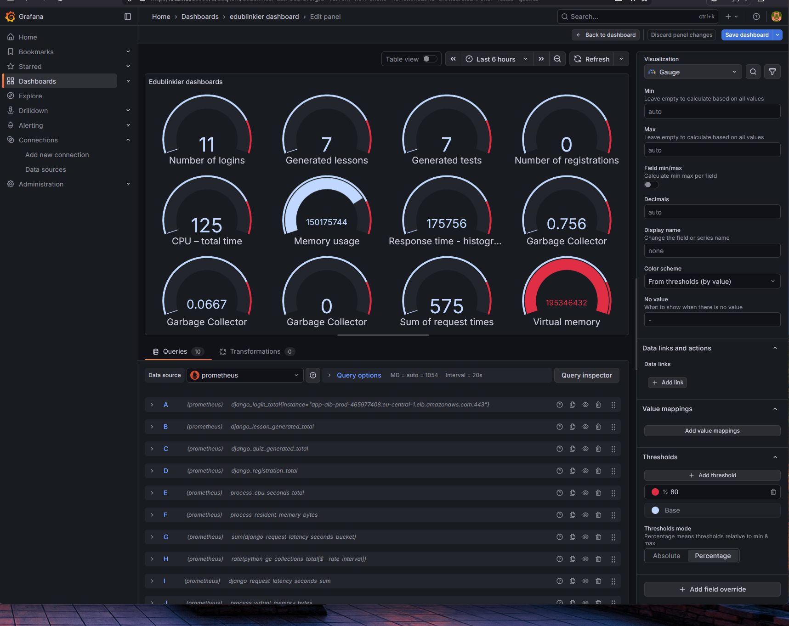

# Edublinkier

**Edublinkier** is a comprehensive platform designed mainly for teachers and schools, allowing them to create AI-powered lessons and tests, manage classes and gradebooks, and plan events. This project emphasizes **full automation** and **modern DevOps practices**. 🚀

---

## 🌐 DevOps Stack and Architecture

The project fully leverages modern DevOps tools and AWS cloud services:

- **Terraform** – Infrastructure as Code (IaC) for:  
  - VPC, subnets, and private security groups  
  - ALB (Application Load Balancer)  
  - RDS database  
  - ECS Fargate for hosting application containers  
  - Route53 for DNS management  

- **Docker** – containerization for backend and frontend:  
  - Automated Docker image builds  
  - Integration with AWS ECS Fargate  

- **AWS ECR** – private Docker registry:  
  - GitHub Actions automatically pushes a new image to ECR on `main` branch commits  

- **GitHub Actions** – CI/CD pipeline:  
  - Automates build and deployment of Docker containers to AWS Fargate  
  - Integrates with ECR, Terraform, and ECS  

- **Monitoring & Observability:**  
  - **Prometheus** – metrics collection and monitoring  
  - **Grafana** – visualization and dashboard creation  

- **DBeaver** – GUI tool for managing AWS RDS databases  

💡 This setup ensures **full automation** and **production-ready deployment** on AWS.

---

## 🖥️ Backend and Frontend

- **Backend:** Django REST Framework – handles application logic, APIs, and user operations  
- **Frontend:** Django Templates – teacher user panel  

---

## 🎓 Platform Features for Teachers

1. **Registration and Login** – secure teacher accounts  
2. **AI-Powered Lesson and Test Generation** – automatically create educational materials  
3. **Class and Gradebook Management:**  
   - Create classes and add students  
   - Enter grades and automatically calculate averages  
4. **Event Calendar** – schedule events with reminders  
5. **Notes and AI Material Generation** – create and analyze teaching materials  
6. **Assign Lessons to Classes** – manage lessons and track history  

---

## 💡 Why Edublinkier

This project demonstrates a combination of **full DevOps automation** and **practical educational logic**, showcasing skills in:

- Cloud infrastructure design and management (AWS) ☁️  
- CI/CD automation (GitHub Actions, Terraform) ⚙️  
- Containerization (Docker, ECS Fargate) 🐳  
- Monitoring and observability (Prometheus, Grafana) 📊  
- Database management (AWS RDS, DBeaver) 🗄️  
- Building scalable web applications in Django 🖥️  

---

---

## 📊 Monitoring & Observability in Action

This project includes a complete observability stack running on EC2 with SSM:
- **Prometheus** for metric scraping  
- **Grafana** for dashboards  
- **Custom Django metrics** for user activity & AI usage  
- **System metrics** (CPU, RAM, GC, latency, etc.)

---

### 🔧 EC2 + SSM: Monitoring Stack Running

Below is a screenshot taken directly from the EC2 instance (connected via SSM), showing the running Docker containers for Prometheus and Grafana:

📸 **EC2 Docker Status**

*(source: `poprawny start docker grafana.png`)*

---

### 📈 Grafana Dashboard Preview

Grafana visualizes all collected metrics, including:
- User login/registration events  
- AI lesson & quiz generation counts  
- Request latency distribution  
- Python GC activity  
- CPU & memory metrics  

📸 **Main Grafana Dashboard**

*(source: `prawidlowy.png`)*

---

### 📊 Prometheus Metrics Overview

| Metric | Description |
|--------|-------------|
| `django_login_total` | Total number of user logins |
| `django_registration_total` | Number of teacher signups |
| `django_lesson_generated_total` | AI-generated lessons |
| `django_quiz_generated_total` | AI-generated quizzes |
| `django_request_latency_seconds_sum` | Total cumulative request time |
| `process_cpu_seconds_total` | CPU usage over time |
| `process_resident_memory_bytes` | RAM usage of backend |
| `python_gc_collections_total` | GC runs (gen0 / gen1 / gen2) |

GC metrics have 0 values in gen1/gen2 unless heavy memory churn occurs — this is normal behavior.

---

### 🧠 Observability Notes

- Prometheus scrapes every **15 seconds**  
- Grafana dashboards auto-refresh  
- EC2 runs fully inside a private subnet, accessed through **SSM only**  
- Dashboard history is persisted  

---

